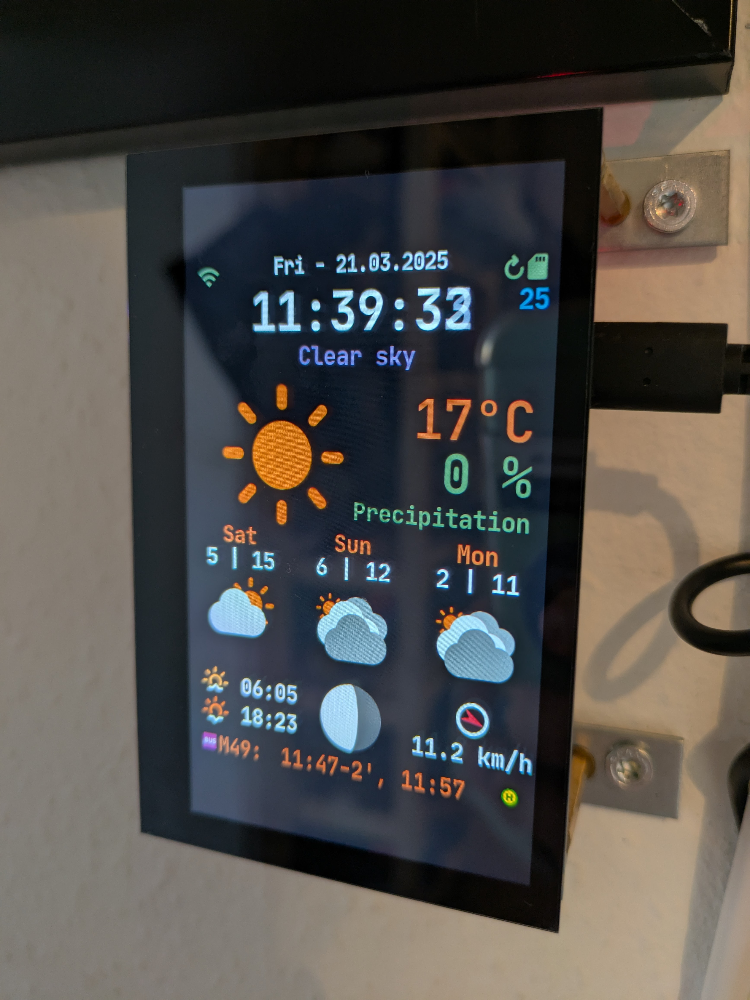

> **Disclaimer**
> This dashboard, run on a Raspberry Pi and displayed on a small TFT display, is heavily inspired by [WeatherPi_TFT](https://github.com/LoveBootCaptain/WeatherPi_TFT) and [BusStopPi](https://github.com/LoveBootCaptain/BusStopPi), so most of the props go to [LoveBootCaptain](https://github.com/LoveBootCaptain) (Stephan Ansorge)! Especially the [WeatherPi_TFT](https://github.com/LoveBootCaptain/WeatherPi_TFT) repository is more general and contains information and manuals about many more displays and settings. Check it out if you do not want to rebuild my exact setup as described below, which works perfectly as of March 2025.

# A low-resource, efficient Dashboard to ease your daily life - Weather and Public Transport (in Berlin) for your 'smart' WG

## Abstract
In here, I explain (for my future me and anyone else reading this, feel free to share!) how to successfully set up on a Pi 4B with the Waveshare 4,3 Zoll QLED Touch Display (DSI, 800x480) and Pi OS 20241119 (bookworm).



> NOTE: Major TODO: Get it running with services; as of now, one has to start and set a few things up manually in a tmux sesssion if a reboot happens...

## Problem Setting
The classic issue: you're living in Berlin, juggling a dozen things at once, and checking the bus times for the stop right outside your door is the last thing on your mind. That’s exactly where this dashboard comes in. It shows you live info for your nearby bus or train stop (you can pick any line or station you want), plus real-time weather data. Basically, the stuff you’re probably already checking on your phone every day—but now it’s just there. Stick it in your hallway and make life easier for you and your flatmates.

## Cost estimate
As of March 2025, the Rasperry Pi 4B that I am using costs ~40€ and the display is ~35€. My mount on the wall is very experimental and did cost me less than 5€.
Assuming a power consumption of the Pi alone of about ~3W (the Pi is mostly idling, but lets be ballpark here. What I should do: Measure the actual consumption with a multimeter) and a consumption of the
display of ~1.2W when it's on (I am not sure about numbers for when it's idling and simply reacting to touch - again, one multimeter would solve all these questions), the operational cost is
0.0042 kW x 24 h/day × 365 days = 36.79 kWh, so ~15€ a year (assuming 40ct/kWh).

## Hardware

### Setup your Pi

- Install OS to an SD card: Easiest with Raspberry Pi Imager.
- Beware about how you want to connect to/set up the Pi; see [this tutorial](https://www.tomshardware.com/reviews/raspberry-pi-headless-setup-how-to,6028.html) for a headless setup without ever having to use a monitor (TL;DR: you can change a config file on the SD card such that the Pi automatically connects to your WiFi network, so you can do everything about/with it via SSH from the start)
- Go through config stuff: [raspi-config](https://www.raspberrypi.org/documentation/configuration/raspi-config.md)
- Update all tools: `sudo apt-get update -y && sudo apt-get upgrade -y`

### Set up the Display

- Luckily, with the Waveshare 4,3 Zoll QLED Touch Display, that we are using, everything works out of the box.
- When you mounted your system, you might need to rotate it properly with the Pi Screen Configuration setting in the OS directly (and potentially manually rotate the touch via a `40-libinput.conf` file), see [this tutorial](https://www.waveshare.com/wiki/4.3inch_DSI_QLED )


## Software

### Install dependencies
Here, it could get a bit tricky as I do not remember precisely anymore if everything worked flawless, but I can assure you that you will get it to work with five minutes of your time and maybe some help by a quick web search.

For [*pygame*](https://www.pygame.org/wiki/CompileUbuntu):
```bash
sudo apt-get install git python3-dev python3-setuptools python3-numpy python3-opengl \
    libsdl-image1.2-dev libsdl-mixer1.2-dev libsdl-ttf2.0-dev libsmpeg-dev \
    libsdl1.2-dev libportmidi-dev libswscale-dev libavformat-dev libavcodec-dev \
    libtiff5-dev libx11-6 libx11-dev fluid-soundfont-gm timgm6mb-soundfont \
    xfonts-base xfonts-100dpi xfonts-75dpi fontconfig fonts-freefont-ttf libfreetype6-dev
```
If you experience `sdl-config command not found`, see [this post](https://stackoverflow.com/questions/19579528/pygame-installation-sdl-config-command-not-found) and consider adding `python-numpy subversion ffmpeg` to the above list.

### Install PiDashboard

- Clone: `git clone https://github.com/MassEast/pi_dashboard.git && cd pi_dashboard`
- Set up venv: `python3 -m venv venv`
- Install requirements: `source venv/bin/activate && sudo pip3 install -r requirements.txt`

### Create a RAM disk to protect your SG card

The PiDashboard will write a json file to your Pi after updating the weather data from the API provider.
This process will reduce writing to your SD card, cause we're writing it only to RAM.
*ramdisk* will only be used in production mode, i.e., you have set your `"ENV"` in your config.json file to `"Pi"`.
To run things locally on my Laptop, I use the "STAGE" environement.

Run
```bash
sudo mkdir /mnt/ramdisk
sudo nano /etc/fstab
```
and add the following line right at the end of the opened file (`size=5M` specifies the size of the reserved ram (5M is more than enough)):
```bash
tmpfs /mnt/ramdisk tmpfs nodev,nosuid,size=5M 0 0
```

Finally mount the RAM disk and reboot your Pi:
```bash
sudo mount -a
sudo reboot
```

If you want to log a lot to files (`"LOG_TO_FILES"` set to `"true"`), you may also consider writing all logs to RAM and only write to the SD card daily, see @azlux: [log2ram](https://github.com/azlux/log2ram).

### Screen blanking

To make your screen blank out in black after some time (which saves energy), you need to uninstall `xscreensaver` by running `sudo apt-get remove xscreensaver` and enable screen blanking in the `sudo raspi-config` settings.

### Dashboard Configuration

To create an empty config file, run
```bash
cp example.config.json config.json
```
and edit it using, e.g., `nano config.json`.

#### Display options
Our display is 800x480 (resp. 480x800, depending on how you turn it). These are the default settings in the example config file.
Further options explained:
- As long as you configure a 3:4 ratio, the Dashboard will be scaled
- `FPS` is used for pygame internal ticks - 30 fps is more than enough to render clock transitions and precipitation
animations smoothly
- `AA` turns antialiasing on and off (leave it on a Pi Zero off, it is performance heavy on higher FPS)
- `ANIMATION` enables the little particle simulation for precipitation, disable will show an image instead
- `SHOW_FPS`: show the current fps on the display
- `SHOW_API_STATS`: show how many API calls are left over (resets every midnight UTC)
- `MOUSE` enable/disable mouse pointer - needed for local development, better leave it disabled

#### weatherbit.io settings
- Replace `xxxxxxxxxxxxxxxxxxxxxxxxx` in  `"WEATHERBIT_IO_KEY": "xxxxxxxxxxxxxxxxxxxxxxxxx"` with your own API key. You can get this key from [weatherbit.io](https://www.weatherbit.io/). You need to register.
- Replace `en` in `"WEATHERBIT_LANGUAGE": "en"` with your preferred language
- Replace `de` in `"WEATHERBIT_COUNTRY": "de"` with your country
- Replace `14057` in `"WEATHERBIT_POSTALCODE": 14057` with your zip code / postal code (this example-location zip code
is from berlin city, germany)
- For language-support, units, etc please refer to -> **[weatherbit API Docs](https://www.weatherbit.io/api)**

#### Hardcoded localise strings and ISO settings
```json
  "LOCALE": {
    "ISO": "en_GB",
    "RAIN_STR": "Rain",
    "SNOW_STR": "Snow",
    "PRECIP_STR": "Precipitation",
    "METRIC": true
  }
```
- Change `"ISO"` and `"METRIC"` according to your needs
- `"METRIC": true` will get all weather data units as metric system, change to `false` if you prefer imperial styled units. Then `°C` will be `°F` and `km/h` will be `mph. This also affects the weatherbit API request via its `units` parameter.

#### Settings for BVG (public transport in Berlin)
```json
  "BVG": {
    "DEPARTURE_ID": "XXXXXXXXX",
    "DIRECTION_ID": "YYYYYYYYY",
    "LINE": "ABC",
    "DURATION": 30
  }
```
As of now, the Dashboard is designed to show one specific connection (I chose the bus line stopping close my home, because that's the one I regularly check whenever I am leaving). In the config, you can set the departure station (`DEPARTURE_ID`) and direction (`DIRECTION_ID`) to find connections into the correct
direction. Finally, you can filter this for the specific `LINE` you are interested in and how far you want to calculate into the future (DURATION). You can find the BVG IDs as I did in `dev/bvg_departures.ipynb` notebook.

#### Theme file and options
Set your theme file [darcula.json, light.json or example.json] in `config.json` via
```json
"THEME": "darcula.theme",
```

- Inside your theme, you can specify with json file with information -> an example for the default theme is in the file `themes/example.json`
- In there, you can change some basic theme information, like colors, formatting, etc.
  - about the colors:
    - "RED" is used for errors in status bar icons and wind direction
    - "BLUE" is used for sync and update in status bar icons and rain precip icon
    - "GREEN" is used for everything fine in status bar icons
- You can change every color of an image by adding a color `(r, g, b)` to the optional `fillcolor` parameter in the `DrawImage` class
- You can change the time and date format according to your preferences
    - a good reference for strftime options can be found here [Python strftime()](https://www.programiz.com/python-programming/datetime/strftime)
    - for 12h clock with am and pm support you can use `"%I:%M:%S %p"` instead of `"%H:%M:%S"` for a 24h clock in `yourTheme.DATE_FORMAT.TIME`
    - for imperial like date format just change `"%A - %d. %b %Y"` to `"%A - %b %d %Y"` in `yourTheme.DATE_FORMAT.DATE`

#### Timer options
```json
  "TIMER": {
    "WEATHER_UPDATE": 1800,
    "WEATHER_RELOAD": 60,
    "BVG_UPDATE": 15,
    "DISPLAY_BLANK": 100
  }
```
- the `WEATHER_UPDATE` timer defines how often the weatherbit API will be called in seconds - as of March 2025, Weatherbit offers 50 free calls per day, so 30min will give you enough API calls over the day
- `WEATHER_RELOAD` defines how often the information on the display will be updated
- `BVG_UPDATE` times the BVG API to get the recent public transport informaion
- `DISPLAY_BLANK` is the time after which all the timed updates stop and the display blanks out. A single touch on the display restarts the timers and lightens up the display again.

## Starting the Dashboard without a Service

This is certinaly not the optimal solution, as any power failure or simply a reboot of the Pi would mean you have to start things up manually again.

To be able to at least exit the ssh connection, start a tmux (`sudo apt-get install tmux`) session (`tmux new`), and run
```bash
export DISPLAY=:0
xset s 60 60
xset dpms 60 60 60
tmux set-environment -g DISPLAY $DISPLAY
```
to enable the screen blanking in this session. Then, activate the venv in the `pi_dashboard` folder (`source venv/bin/activate`)
and start the Dashboard (`python3 PiDashboard.py`).

Then tmux disconnect (ctrlB + ctrlD) from that window and the Dashboard will keep running if disconnected from ssh.


## TODO: Setting up the Dashboard as a Service

TODO: have to put the display blank stuff in chron job thats also automatically starting for this app anyway
have it automatically from the config file!

sadly pygame doesn't like to work well with systemd... so it has to run as init.d service.
maybe someone can help to solve this one time.

```bash
cd
cd pi_dashboard
sudo cp PiDashboard.sh /etc/init.d/PiDashboard
```

### run python with root privileges

* this is useful if you like to run your python scripts on boot and with sudo support in python
```bash
sudo chown -v root:root /usr/bin/python3
sudo chmod -v u+s /usr/bin/python3
```

TODO: keep going here: https://chatgpt.com/c/6741bd6c-7504-8003-95d4-f15392395b59
vis simply doesnt show up when launched via service....

### test the services

* for the PiDashboard Service
```bash
sudo service PiDashboard start
sudo service PiDashboard stop
sudo service PiDashboard restart
sudo service PiDashboard status
```

* if this is doing what it should you can run the service every time you boot your pi
```bash
sudo update-rc.d PiDashboardTFT defaults
```


## Credits
- *[LoveBootCaptain](https://github.com/LoveBootCaptain) (Stephan Ansorge) for laying the foundation of this work in [WeatherPi_TFT](https://github.com/LoveBootCaptain/WeatherPi_TFT). Subscredits by Stephan:
  - inspiration from [squix78](https://github.com/squix78) with their [esp8266 weather station color](https://github.com/squix78/)
  - [adafruit](https://github.com/adafruit) for [hardware](https://www.adafruit.com/) and [tutorials](https://learn.adafruit.com/)
  - [weatherbit.io](https://www.weatherbit.io/) for weather api and [documentation](https://www.weatherbit.io/api)
  - weather icons: [@erikflowers](https://github.com/erikflowers) [weather-icons](https://github.com/erikflowers/weather-icons), making them colorful was my work
  - statusbar icons: [google](https://github.com/google) [material-design-icons](https://github.com/google/material-design-icons)
  - default font: [google - roboto](https://fonts.google.com/)
  - darcula font: [jetbrains - mono](https://www.jetbrains.com/lp/mono/)
  - moon phase rendering: [@miyaichi for his awesome fork](https://github.com/miyaichi/WeatherPi) and great ideas
